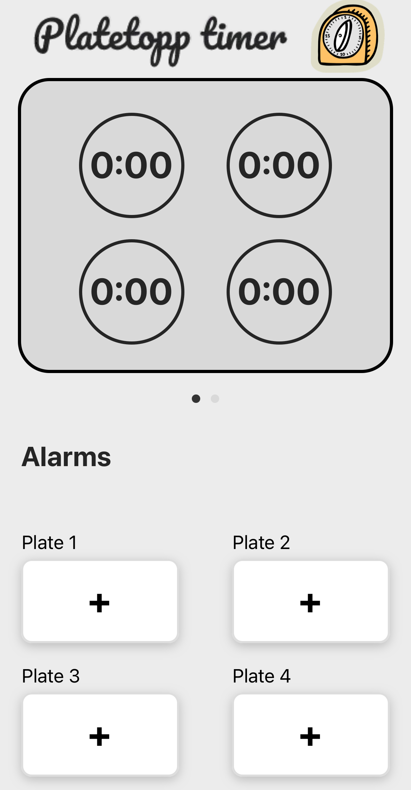

# PlateToppTimer App

This is a kitchen timer app built using [Expo](https://expo.dev/) and JavaScript. It allows users to set timers for different kitchen plates and keeps track of the countdowns on a kitchen counter interface. The app provides a user-friendly interface to control multiple timers simultaneously.

## Credits
- **Design & Concept**: Kristoffer c:  
  Came up with the original idea and created the visual design and user interface of the app.
- **Coding**: [Beatrice Valdés Bretti](https://www.beatricevaldesbretti.com) :
  Developed the app functionality and implemented the features.
  
## Features

- **Multiple Timer Support**: Set individual timers for up to four different kitchen plates.
- **Custom Timer Setup**: Set custom hours, minutes, and seconds for each timer using a picker.
- **Kitchen Counter**: A kitchen counter screen showing the active timers and their countdowns.
- **Alarm System**: A section to display the timers for each plate (static, not counting down).
- **Smooth Navigation**: Easy navigation between the timer setup and the main kitchen counter screens.
- **Expo Integration**: Built using Expo for cross-platform compatibility (iOS and Android).

## Screenshots
1. **Home Screen**
   
2. **Set Timer Screen**
   

## Installation

Follow these steps to get the app running locally on your device:

1. **Clone the Repository**:

   ```bash
   git clone https://github.com/beatricebretti/PlateToppTimer
   cd PlateToppTimer
   ```

2. **Install Dependencies**:

   Make sure you have Node.js installed. Then, run the following command:

   ```bash
   npm install
   ```

3. **Start the Expo Project**:

   Once the dependencies are installed, you can start the project using Expo:

   ```bash
   npx expo start
   ```

4. **Run on Device**:

   You can either run the app on an emulator (iOS or Android) or scan the QR code generated by Expo to run it directly on your device using the Expo Go app.

## Usage

1. **Set a Timer**: From the home screen, tap the "+" button for any plate, choose the desired time, and set it. The timer will start counting down on the kitchen counter screen.
2. **Pause/Reset**: Each timer is displayed with its countdown, and you can pause/reset it as needed.

## File Structure

Here’s an overview of the key files and directories in the project:

```bash
├── App.js                # Main entry point of the app
├── components/           # UI components (KitchenCounter, TimerButton, etc.)
├── contexts/             # TimerContext to handle timer logic
├── screens/              # Different screens (HomeScreen, SetTimerScreen, etc.)
├── assets/               # App assets (images, icons, etc.)
└── README.md             # This readme file
```

## Contributing

Contributions are welcome! If you'd like to contribute to the project, please follow these steps:

1. Fork the repository.
2. Create a new branch (`git checkout -b feature-name`).
3. Make your changes.
4. Commit your changes (`git commit -m 'Add feature'`).
5. Push to the branch (`git push origin feature-name`).
6. Open a pull request.

